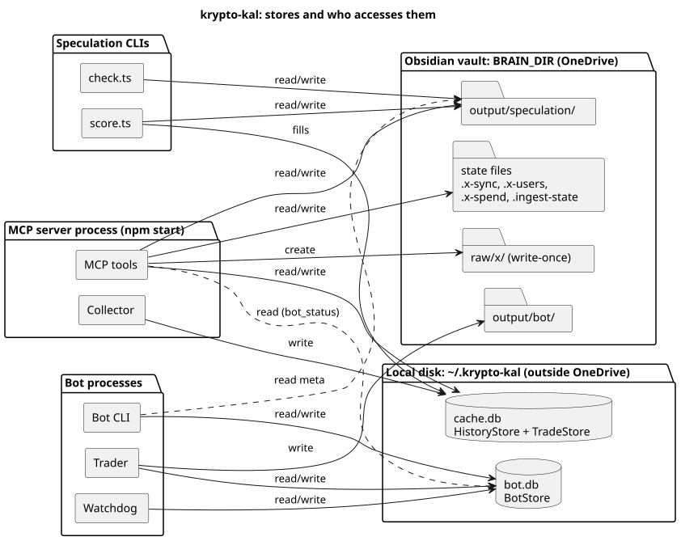
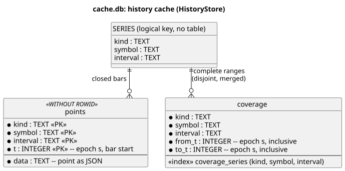
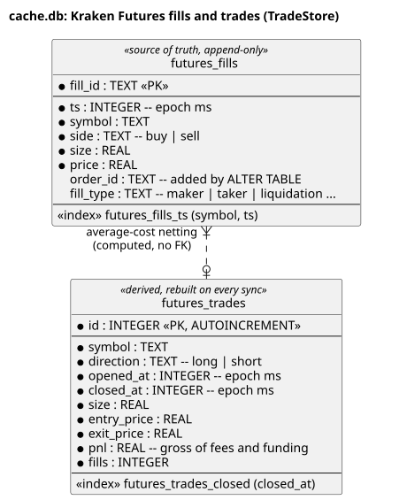
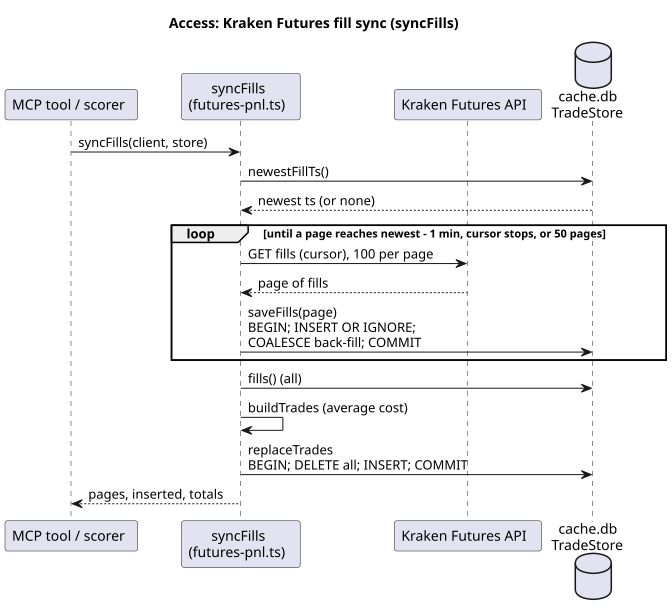
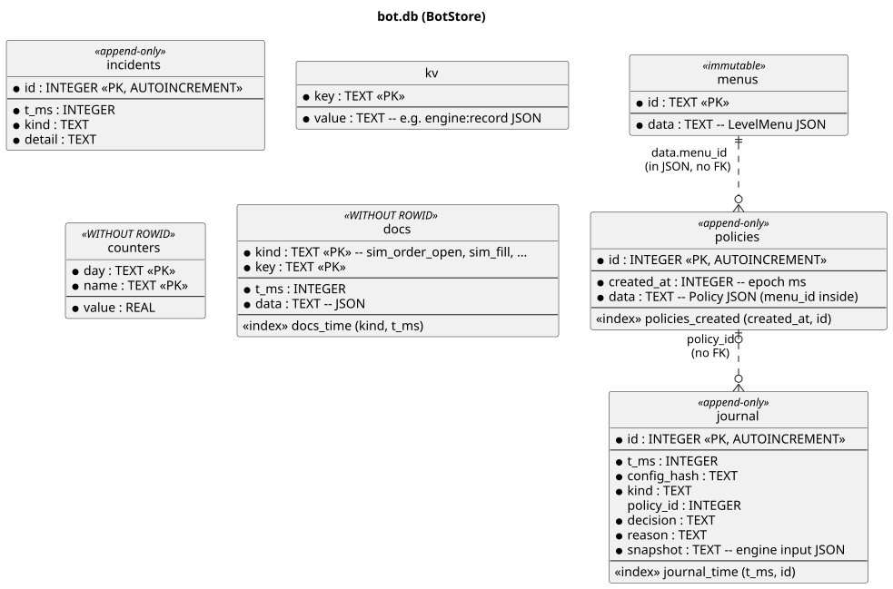
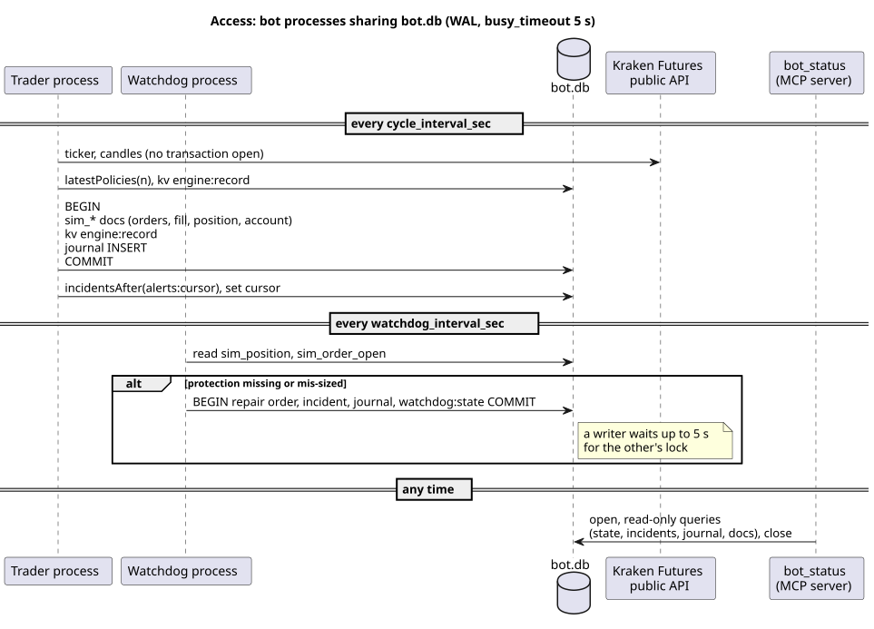

# Database design and access model

This document describes what krypto-kal stores, where it stores it, the schema of every table and state file, and
which process reads and writes what. It was written from the code as of 2026-10-05: `src/core/history-store.ts`,
`src/trading/trade-store.ts`, `src/bot/bot-store.ts`, `src/brain/` and `src/speculation/`.

Diagrams are PlantUML sources in [diagrams/](diagrams/) with rendered SVGs next to them. After editing a `.puml`,
re-render with `java -jar plantuml.jar -tsvg docs/diagrams/*.puml` (entity diagrams need Graphviz installed).

## 1. Overview

There is no database server. Persistent state is split between two kinds of storage:

- **Embedded SQLite files** (`node:sqlite`, `DatabaseSync`, synchronous API), opened in-process. They live on the
  local disk outside OneDrive because the sync client can lock SQLite files:
  - `cache.db`: market history cache plus Kraken Futures fills and trades;
  - `bot.db`: the trading bot's state, journal and simulated exchange.
- **JSON and Markdown files in the Obsidian vault** (`BRAIN_DIR`): state of the X sync, the ingest progress and the
  speculation logs. These files are meant to be read by people, synced by OneDrive and edited by Claude skills.

| Store | Default path | Override | Owner (writer) | Readers |
|---|---|---|---|---|
| `cache.db` | `~/.krypto-kal/cache.db` | `CACHE_DB_PATH` | MCP server (`HistoryStore`, `TradeStore`); the speculation scorer CLI (`TradeStore`) | the same |
| `bot.db` | `~/.krypto-kal/bot.db` | `db_path` in the bot config (`BOT_CONFIG`) | bot trader and watchdog processes, bot CLI | MCP tool `bot_status` |
| Vault state files | `<BRAIN_DIR>/.*.json` | `BRAIN_DIR` | X sync, triage (`brain_ingest_mark`) | X sync, triage |
| Vault speculation logs | `<BRAIN_DIR>/output/speculation/` | `BRAIN_DIR` | speculation checker and scorer | scorer, `speculation-to-bot`, Claude skills |



Source: [diagrams/storage-overview.puml](diagrams/storage-overview.puml)

## 2. Common conventions

- **Schema creation:** every store creates its tables with `CREATE TABLE IF NOT EXISTS` in its constructor. There is
  no migration framework and no schema version table. Columns added later are added with a guarded `ALTER TABLE`
  (see `futures_fills`).
- **Journal mode:** every SQLite connection sets `PRAGMA journal_mode = WAL`, so readers do not block the writer and
  several connections (or processes) can have the same file open.
- **Lock waits:** `TradeStore` and `BotStore` set `PRAGMA busy_timeout = 5000`: a writer that finds the file locked
  waits up to 5 s instead of failing with `SQLITE_BUSY`. `HistoryStore` does not set it (see section 7).
- **Transactions:** stores wrap multi-statement writes in `BEGIN` / `COMMIT`, with `ROLLBACK` on any exception.
  `BotStore.transaction()` is reentrant: nested calls join the outermost transaction.
- **Payloads as JSON text:** where the shape belongs to the domain (series points, policies, simulated orders), it is
  stored as JSON in a `TEXT` column (`data`, `snapshot`, `value`) and typed in TypeScript. Only the columns used for
  keys, ordering and filtering are real columns. A schema change of a payload therefore needs no migration, but old
  rows keep their old shape: readers merge stored objects over defaults (`{ ...default(), ...parsed }`).
- **Time:** `HistoryStore` uses epoch **seconds** (`t`, `from_t`, `to_t`); `TradeStore` and `BotStore` use epoch
  **milliseconds** (`ts`, `*_at`, `t_ms`). Vault files use ISO 8601 strings.
- **Access layer:** each store is a class with typed methods and prepared statements; no SQL outside the class. All
  parameters are bound (`?`), never concatenated; the only dynamic SQL is the `WHERE` built from fixed column names in
  `TradeStore`.

## 3. `cache.db`

One file, two independent table groups, two connections in the MCP server process (`HistoryStore` and `TradeStore`
open the same path).

### 3.1 History cache (`HistoryStore`)

Read-through cache of time series from Coinalyze and Yahoo Finance. Logic: `cachedSeries()` in
`src/core/series-cache.ts`; design notes in `CLAUDE.md` ("History cache").

```sql
CREATE TABLE points (
  kind     TEXT    NOT NULL,  -- provider + variant, e.g. "open-interest-history:usd", "yahoo-chart"
  symbol   TEXT    NOT NULL,  -- e.g. "BTCUSDT_PERP.A", "^GSPC"
  interval TEXT    NOT NULL,  -- provider interval, e.g. "1hour", "1d"
  t        INTEGER NOT NULL,  -- bar start, epoch seconds
  data     TEXT    NOT NULL,  -- the whole point as JSON (always includes t)
  PRIMARY KEY (kind, symbol, interval, t)
) WITHOUT ROWID;

CREATE TABLE coverage (
  kind     TEXT    NOT NULL,
  symbol   TEXT    NOT NULL,
  interval TEXT    NOT NULL,
  from_t   INTEGER NOT NULL,  -- inclusive, epoch seconds
  to_t     INTEGER NOT NULL   -- inclusive, epoch seconds
);
CREATE INDEX coverage_series ON coverage (kind, symbol, interval);
```



Source: [diagrams/cache-history.puml](diagrams/cache-history.puml)

`SERIES` is not a table: it is the logical key `(kind, symbol, interval)` that both tables share.

**Semantics.**

- `points` holds only **closed** bars (`t <= closedUntil`). The open tail is always fetched live and never stored.
- `coverage` holds the time ranges known to be complete for a series. A range can be covered and contain no points
  (a weekend, a period before listing); that is how "no data" is told apart from "not fetched yet".
- Invariant: for each series, `coverage` rows are disjoint and non-adjacent. `save()` merges the new range with the
  existing ones (`mergeRanges`) and rewrites the series' coverage rows in the same transaction as the points.
- `kind` values: Coinalyze uses the endpoint path, plus `:usd` when `convert_to_usd` is on; Yahoo uses `yahoo-chart`.
- Yahoo prices are split-adjusted only. A response with a split dated after cached bars calls `deleteSeries(kind,
  symbol)`, which removes all intervals of that symbol (points and coverage) in one transaction.

**Access methods.**

| Method | SQL | Used by |
|---|---|---|
| `getPoints(key, range)` | `SELECT data ... WHERE kind, symbol, interval AND t BETWEEN ? AND ? ORDER BY t` (primary key range scan) | `cachedSeries` |
| `coverage(key)` / `missing(key, range)` | `SELECT from_t, to_t ... ORDER BY from_t`, then subtraction in TypeScript | `cachedSeries` |
| `save(key, range, points)` | `INSERT OR REPLACE` points, `DELETE` + `INSERT` merged coverage, one transaction | `cachedSeries`, collector |
| `hasPointsBefore(key, t)` | `SELECT 1 ... AND t < ? LIMIT 1` | Yahoo split check |
| `deleteSeries(kind, symbol)` | two `DELETE`s, one transaction | Yahoo split handling |

### 3.2 Kraken Futures fills and trades (`TradeStore`)

Local copy of the account's fill history (the API returns at most 100 fills per page) and the closed trades derived
from it. Logic: `syncFills()` and `buildTrades()` in `src/trading/futures-pnl.ts`.

```sql
CREATE TABLE futures_fills (
  fill_id   TEXT PRIMARY KEY,   -- Kraken's fill id
  ts        INTEGER NOT NULL,   -- fill time, epoch ms
  symbol    TEXT NOT NULL,      -- e.g. "PF_XBTUSD"
  side      TEXT NOT NULL,      -- "buy" | "sell"
  size      REAL NOT NULL,      -- contracts
  price     REAL NOT NULL,
  order_id  TEXT,               -- added later (ALTER TABLE); NULL in old rows until back-filled
  fill_type TEXT                -- added later: "maker" | "taker" | "liquidation" | ...
);
CREATE INDEX futures_fills_ts ON futures_fills (symbol, ts);

CREATE TABLE futures_trades (
  id          INTEGER PRIMARY KEY AUTOINCREMENT,
  symbol      TEXT NOT NULL,
  direction   TEXT NOT NULL,    -- "long" | "short"
  opened_at   INTEGER NOT NULL, -- epoch ms
  closed_at   INTEGER NOT NULL, -- epoch ms
  size        REAL NOT NULL,    -- peak size
  entry_price REAL NOT NULL,    -- average-cost entry
  exit_price  REAL NOT NULL,    -- average exit
  pnl         REAL NOT NULL,    -- gross of fees and funding
  fills       INTEGER NOT NULL  -- number of fills in the trade
);
CREATE INDEX futures_trades_closed ON futures_trades (closed_at);
```



Source: [diagrams/cache-fills.puml](diagrams/cache-fills.puml)

**Semantics.**

- `futures_fills` is the **source of truth** and is append-only: `INSERT OR IGNORE` on `fill_id`, so a re-synced page
  is harmless. The only update back-fills `order_id` / `fill_type` with `COALESCE`, never overwriting a value.
- `futures_trades` is a **derived table**. Average-cost netting depends on the whole history, so every sync deletes it
  and rebuilds it from all fills, in one transaction. There is no foreign key from trades to fills; a trade carries
  only the fill count.
- The schema migration is in the constructor: `PRAGMA table_info(futures_fills)` and `ALTER TABLE ... ADD COLUMN` for
  `order_id` and `fill_type` when missing.



Source: [diagrams/fill-sync.puml](diagrams/fill-sync.puml)

**Sync protocol** (`syncFills`): read pages newest-first from the API; stop when a page reaches the newest stored fill
minus a 1-minute overlap, or when the cursor stops moving, or after 50 pages (the first run). Then rebuild the trades.
Callers: the MCP tools `kraken_futures_fills`, `kraken_futures_pnl` and `speculation_score`, and the speculation
scorer CLI (`src/speculation/fetch.ts`, which opens its own `TradeStore` on `CACHE_DB_PATH`).

**Queries:** `fills(filter, limit)` and `trades(filter)` filter on optional `symbol`, `from` and `to` (the fills'
`ts` or the trades' `closed_at`), ordered by time. `newestFillTs`, `oldestFillTs`, `countFills` are aggregates.

## 4. `bot.db` (`BotStore`)

The trading bot's only state. Shared by separate OS processes: the trader and the watchdog (`npm run bot -- run`
starts both), the bot CLI (`policy add`, `status`, `report`, `ack-halt`) and, read-only by convention, the MCP tool
`bot_status`. Nothing is kept in memory between cycles: every step reads fresh state from the file.

```sql
CREATE TABLE menus (            -- price level menus that policies refer to by level id
  id   TEXT PRIMARY KEY,
  data TEXT NOT NULL            -- LevelMenu JSON: { id, symbol, createdAtMs, levels: [{ id, price, kind }] }
);

CREATE TABLE policies (         -- trading policies (from the analyst, the CLI or a speculation bet)
  id         INTEGER PRIMARY KEY AUTOINCREMENT,  -- assigned by the store, never by the LLM
  created_at INTEGER NOT NULL,                   -- epoch ms
  data       TEXT NOT NULL                       -- Policy JSON (PolicySchema, src/bot/policy.ts)
);
CREATE INDEX policies_created ON policies (created_at, id);

CREATE TABLE kv (               -- small named state values
  key   TEXT PRIMARY KEY,
  value TEXT NOT NULL
);

CREATE TABLE counters (         -- per trading day counters (orders, entries, losses)
  day   TEXT NOT NULL,          -- trading day, "YYYY-MM-DD" from day_reset_utc_hour
  name  TEXT NOT NULL,
  value REAL NOT NULL,
  PRIMARY KEY (day, name)
) WITHOUT ROWID;

CREATE TABLE journal (          -- every decision with its input snapshot
  id          INTEGER PRIMARY KEY AUTOINCREMENT,
  t_ms        INTEGER NOT NULL,
  config_hash TEXT NOT NULL,    -- hash of the bot config the decision was made with
  kind        TEXT NOT NULL,    -- e.g. "cycle", watchdog decisions
  policy_id   INTEGER,          -- logical reference to policies.id (no FK)
  decision    TEXT NOT NULL,
  reason      TEXT NOT NULL,
  snapshot    TEXT NOT NULL     -- JSON: the engine's input at decision time
);
CREATE INDEX journal_time ON journal (t_ms, id);

CREATE TABLE docs (             -- generic JSON documents (the simulated exchange)
  kind TEXT NOT NULL,
  key  TEXT NOT NULL,
  t_ms INTEGER NOT NULL,        -- orders listings; meaning depends on the kind
  data TEXT NOT NULL,
  PRIMARY KEY (kind, key)
) WITHOUT ROWID;
CREATE INDEX docs_time ON docs (kind, t_ms);

CREATE TABLE incidents (        -- problems for the user; append-only
  id     INTEGER PRIMARY KEY AUTOINCREMENT,
  t_ms   INTEGER NOT NULL,
  kind   TEXT NOT NULL,         -- e.g. "no_sl", "cannot_verify", "watchdog:no_tp", "halt_acknowledged"
  detail TEXT NOT NULL
);
```



Source: [diagrams/bot-db.puml](diagrams/bot-db.puml)

No relationship is enforced by SQLite (no `FOREIGN KEY`): `policies.data.menu_id → menus.id` lives inside JSON and is
checked by `validatePolicy` when a policy is used; `journal.policy_id → policies.id` is informational.

### 4.1 Table rules

| Table | Write pattern | Rule |
|---|---|---|
| `menus` | `INSERT` only | Immutable: a duplicate id throws, so the prices a stored policy refers to can never change. |
| `policies` | `INSERT` only | Never updated or deleted. The engine reads the newest N by `created_at DESC, id DESC` (`latestPolicies`) and acts only when enough copies agree (`loosen_confirm_cycles`); a late-finishing older analyst call cannot shadow a newer policy. |
| `kv` | `INSERT OR REPLACE` | Whole-value replace; values are strings, mostly JSON. |
| `counters` | upsert | `addCounter` adds (`value + excluded.value`); `raiseCounter` takes `max(value, excluded.value)`, so rebuilding from exchange history never lowers a count. |
| `journal` | `INSERT` only | `appendJournal` throws if the write fails: the engine must not act on a decision it could not record. Repeated identical cycle decisions are de-duplicated by the trader (`journal:last`). |
| `docs` | `INSERT OR REPLACE`, `DELETE` | The simulated exchange's mutable records. |
| `incidents` | `INSERT` only | Alerting reads them with a cursor (`incidentsAfter(id)`), so each incident is reported once. |

### 4.2 `kv` keys

| Key | Value (JSON unless noted) | Writer |
|---|---|---|
| `engine:record` | `EngineRecord`: state (`FLAT` … `HALTED`), `sinceMs`, `halt`, `trade`, `cooldownUntilMs`, `reconciled`, `lastClockMs`, `tradeStartedMs`, `inZoneSinceMs`, `liqAckMs` | trader, watchdog, reconciliation, CLI `ack-halt` (`src/bot/engine-state.ts`) |
| `watchdog:state` | `WatchdogState`: problem start, failed repairs, attempt counters, last reported issues | watchdog |
| `contract:cache` | the futures contract's specs (tick and size steps) | trader |
| `journal:last`, `journal:unavailable` | last journalled decision; last "snapshot unavailable" note | trader (de-duplication) |
| `alerts:cursor` | text: id of the last incident sent to the alert sinks | trader (`alerts.ts`) |
| `alerts:halt` | text: the halt last reported | trader (`alerts.ts`) |
| `runner:funding_hour`, `runner:funding_error`, `runner:report_hour` | text hour number / JSON error; once-per-hour markers | trader (`runner.ts`) |
| daily limit markers | text: day | `limits.ts` |

`engine:record` is a single row on purpose: a state transition is one atomic write, and a restart resumes exactly where
it stopped. A record that cannot be parsed or has an unknown state throws (the bot stops) instead of guessing.

### 4.3 `docs` kinds (the simulated exchange, `src/bot/dry-run-executor.ts`)

| `kind` | `key` | `t_ms` | `data` |
|---|---|---|---|
| `sim_order_open` | `cliOrdId` | received time | `SimOrder`: `orderId`, request, status, filled size, times |
| `sim_order_done` | `cliOrdId` | received time | the same, once filled or cancelled (moved from `sim_order_open`) |
| `sim_fill` | fill id | fill time | `FuturesFill` |
| `sim_position` | symbol | last change | `{ size (signed), avgPrice, fundingPaid, openedAtMs }` |
| `sim_account` | `acct` | last change | `{ realizedPnl, fees, funding }` |
| `sim_meta` | `meta` | last tick | `{ nextOrderId, nextFillId, lastTickMs, lastFundingMs, price }` |
| `sim_position_history` | `hist` | last change | last 500 `{ t, size }` after each fill (for funding) |
| `funding_mark` | hour number | mark time | `{ t, funding }`: cumulative funding at each hour (reports) |

Open and finished orders are separate kinds so that listing open orders stays cheap while a retried `cliOrdId` still
finds the finished order (idempotent order placement). Every executor call runs inside `store.transaction()`, so an
order's fill, the position and the account change together or not at all.

### 4.4 Concurrency in `bot.db`



Source: [diagrams/bot-concurrency.puml](diagrams/bot-concurrency.puml)

- Two writer processes (trader, watchdog) plus the CLI. SQLite allows one writer at a time; WAL lets readers proceed,
  and `busy_timeout = 5000` makes a writer wait for the lock instead of failing.
- Transactions are short: market data is read from the API before the simulated exchange opens a transaction, and
  no network call happens inside one.
- The watchdog only reduces risk (repairs a stop, closes a position), so a race with the trader can at worst duplicate a
  protective action, which the `cliOrdId` idempotency and the reduce-only caps absorb.
- `bot_status` opens its own `BotStore` per call and closes it at the end. It only calls read methods; note that the
  constructor still runs the `CREATE TABLE IF NOT EXISTS` statements, so it needs write access to the file and would
  create the tables in an empty file (it checks that the file exists first).

## 5. Vault files (`BRAIN_DIR`)

Small state files are plain JSON, read with a fallback (missing or unreadable file = empty state) and written whole
(`writeFile`, pretty-printed). `Brain` (`src/brain/brain.ts`) resolves every path inside the vault and refuses paths that
escape it; MCP writes are limited to `wiki/` and `output/`, and `raw/` is write-once (`wx` flag, never rewritten).

### 5.1 X sync and ingest state

| File | Shape | Writer | Purpose |
|---|---|---|---|
| `.x-sync.json` | `{ queries: { "<query string>": { newestId, syncedAt } } }` | `x-sync.ts` | per-query cursor (newest post id); queries no longer in use are dropped |
| `.x-users.json` | `{ users: { "<lowercase username>": XUser & { checkedAt, missing? } } }` | `x-sync.ts` | author profile cache (refreshed weekly) so searches need no paid expansions |
| `.x-spend.json` | `{ days: { "YYYY-MM-DD": usd } }` | `x-sync.ts` | estimated spend per UTC day for the daily / total budget |
| `.ingest-state.json` | `{ done: { "<raw path>": { status: "ingested" \| "skipped", reason?, atMs } } }` | `brain_ingest_mark` (`triage.ts`) | which raw posts are done, so triage never offers them again |
| `x-accounts.json` | curated accounts and topics (user-edited) | the user | input of the sync and triage |
| `raw/x/<day>/<user>-<id>.md` | YAML frontmatter + post text | `x-sync.ts` | the immutable source archive (the file name is the primary key) |

### 5.2 Speculation logs (`output/speculation/`)

| File | Shape (`src/speculation/types.ts`) | Writer |
|---|---|---|
| `<day>/<HHMMZ>.meta.json` | `ReportMeta`: session, bias, window, symbols, `bets`; the checker adds `validated`, `dropped`, `verification` | the `speculate` skill, then `check.ts` |
| `bets-log.json` | `LoggedBet[]`: each validated bet (id `YYYYMMDD-HHMMZ-SYMBOL-n`) with `hypothetical` and `actual` outcomes once scored | `check.ts` appends (a rerun replaces the report's entries), `score.ts` fills outcomes |
| `reports-log.json` | `ReportLogEntry[]`: one per report, with the bias `outcome` once scored | `check.ts`, `score.ts` |
| `<day>/_day.md`, `_scorecard.md` | Markdown | `score.ts` |

The bet id is the join key: `bets-log.json` ↔ the meta file's `validated[]`, and the bot's policies carry it in
`sources` (`policy from-speculation`). Fills are joined to bets by contract, side, time window and a price tolerance
(`SPECULATION_MATCH_TOLERANCE`), not by id.

## 6. Access model by component

| Component | Process | `cache.db` | `bot.db` | Vault |
|---|---|---|---|---|
| MCP server (`npm start`) | long-running, one per machine | read/write: `HistoryStore` (one per process), `TradeStore` (one per process) | read: `bot_status` opens and closes per call | read/write through `Brain` (`wiki/`, `output/`, state files; `raw/` write-once) |
| Collector | inside the MCP server | write via `cachedSeries` | none | X sync when `X_COLLECT=true` |
| Speculation checker (`check.ts`) | CLI, short | none | none | read/write meta, logs, report `.md` |
| Speculation scorer (`score.ts`, `speculation_score`) | CLI or MCP | read/write `futures_fills` / `futures_trades` | none | read/write logs, scorecards |
| Bot trader | long-running (`npm run bot -- run`) | none | read/write | write `output/bot/` alerts and reports |
| Bot watchdog | long-running, separate process | none | read/write | none |
| Bot CLI (`policy`, `status`, `report`, `ack-halt`) | CLI, short | none | read/write | read speculation meta (`from-speculation`) |

**Credentials and safety.** No store contains API keys or secrets: keys stay in `.env`. `cache.db` holds the account's
fills (private trading history), so treat the file as private. The bot cannot place real orders in this iteration;
everything under `sim_*` is simulated.

**Statelessness of the server.** Each HTTP request creates a new `McpServer`, but the stores are module-level
singletons, so every request shares one connection per store, and their caches and throttles. `DatabaseSync` is
synchronous: a query blocks the event loop for its duration, which is fine for these small indexed queries.

## 7. Known gaps and recommendations

1. **`HistoryStore` has no `busy_timeout`.** The scorer CLI and the MCP server can open `cache.db` at the same time;
   `TradeStore` waits for the lock, but `HistoryStore` would fail at once with `SQLITE_BUSY` if the other connection
   is writing. Add `PRAGMA busy_timeout = 5000` to its constructor.
2. **No schema version.** Migrations are ad hoc (`PRAGMA table_info` + `ALTER TABLE`). If more changes come, add a
   `PRAGMA user_version` per file and a numbered list of migrations.
3. **No foreign keys.** References (`menu_id`, `policy_id`, bet ids) are logical. That is deliberate for append-only
   logs, but the integrity checks live only in code (`validatePolicy`).
4. **Unbounded growth.** `journal`, `incidents`, `sim_fill`, `funding_mark`, `points` and `futures_fills` are never
   pruned. The journal snapshot is the largest; add a retention job (e.g. journal snapshots older than 90 days) when
   the file grows.
5. **Vault JSON writes are not atomic.** `writeFile` replaces the file in place; a crash or an OneDrive sync in the
   middle can leave it truncated, and the reader then falls back to empty state (lost cursors cost a re-read of up
   to `X_BACKFILL_HOURS` of posts; a lost `.ingest-state.json` re-offers ingested posts). Write to a temporary file and
   `rename` it instead.
6. **Read-only access is by convention.** `bot_status` opens `bot.db` read-write. Opening it with
   `new DatabaseSync(path, { readOnly: true })` (and skipping the `CREATE` statements) would make that guarantee
   structural.
7. **Mixed time units.** Seconds in `HistoryStore`, milliseconds elsewhere; column names (`t` vs `ts`/`t_ms`) are the
   only hint. Keep the suffix convention (`_ms`) for new columns.

## 8. Inspecting the databases

```powershell
sqlite3 $HOME\.krypto-kal\cache.db ".tables"
sqlite3 $HOME\.krypto-kal\cache.db "SELECT kind, symbol, interval, COUNT(*) FROM points GROUP BY 1,2,3;"
sqlite3 $HOME\.krypto-kal\cache.db "SELECT symbol, datetime(ts/1000,'unixepoch'), side, size, price, fill_type FROM futures_fills ORDER BY ts DESC LIMIT 20;"
sqlite3 $HOME\.krypto-kal\bot.db "SELECT value FROM kv WHERE key = 'engine:record';"
sqlite3 $HOME\.krypto-kal\bot.db "SELECT datetime(t_ms/1000,'unixepoch'), kind, detail FROM incidents ORDER BY id DESC LIMIT 20;"
```

Read while the server or the bot is running is safe (WAL). Do not edit `bot.db` by hand while the bot runs; stop it
first, or use the CLI (`ack-halt`, `policy add`).
