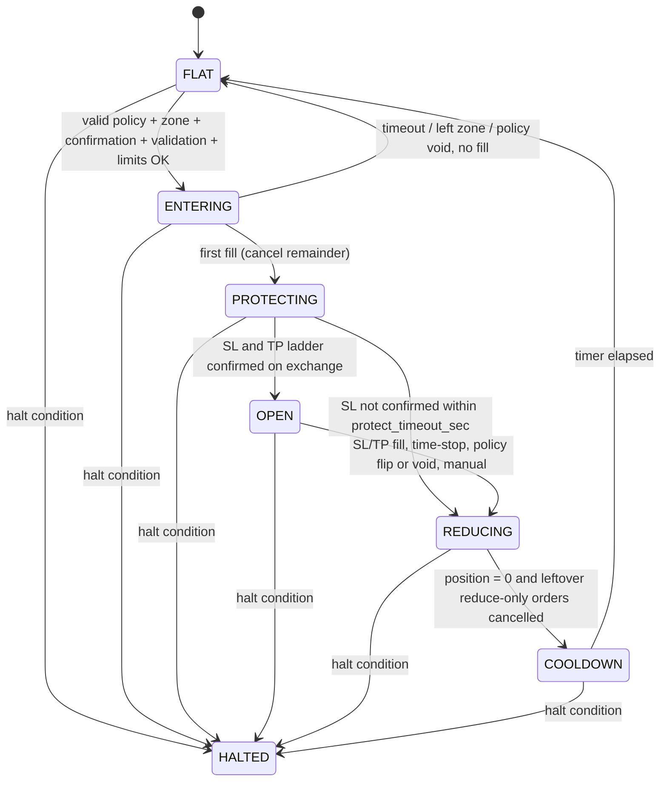

# Kraken Futures bot: trader core design

Date: 2026-10-03. Status: draft for review. Scope: sub-project 1 of 3 (trader core) plus the contracts it shares
with the other two.

## 1. Context and goal

A bot for Kraken Futures where a slow LLM loop produces a validated **policy** and a deterministic engine acts only
within that policy and within hard limits from a config file the LLM never reads. The LLM never places orders.

Iteration 1 is **training wheels**: no real orders can be placed. Everything runs through a `DryRunExecutor`
against live market data with read-only keys.

### Decisions taken in brainstorming

| Topic | Decision |
|---|---|
| Stack | TypeScript on Node >= 23.6 (types stripped, `erasableSyntaxOnly`), reusing `KrakenFuturesClient`, `CounterLimiter`, `createLogger`, SQLite via `node:sqlite` |
| Host | This Windows PC, running only while it is on. Downtime is a normal state |
| Process structure | Three processes (analyst, trader, watchdog) that coordinate only through SQLite. One launcher starts them |
| Ingest | A local Ollama model runs X posts -> wiki -> `output/` as a deterministic pipeline (the model only classifies and drafts) |
| Policy LLM | `claude -p` (headless Claude Code) reads **only** the vault folder `pierdoly/krypto-kal/output/` plus a code-built level menu |
| Instrument | One symbol, `PF_XBTUSD`, set in config |
| Who writes the code | The user. The assistant writes this spec, the test plan and test skeletons, and reviews code |

### Decomposition (each gets its own spec, plan and build cycle)

1. **Trader core** (this document): state machine, policy and config schemas, Executor, sizing, the SL/TP
   invariant, reconciliation, watchdog, journal, report. No LLM dependency; it reads policies from a table, so it can
   run on hand-written fixture policies.
2. **Analyst**: the `claude -p` loop. Builds the level menu, calls the model, validates the policy, writes it to SQLite.
3. **Ollama ingest**: replaces the Claude-run `brain-ingest` skill. The existing skill keeps working until then.

Build order: 1, 2, 3.

## 2. Verified and assumed Kraken Futures behaviour

Sources: the [send order](https://docs.kraken.com/api/docs/futures-api/trading/send-order/) and
[batch order](https://docs.kraken.com/api/docs/futures-api/trading/send-batch-order/) docs, read through a page
summarizer, so fine details are not confirmed.

**Verified**
- No OTO, OCO or bracket order, in `sendorder` or in the batch endpoint. Batch instructions run sequentially and are
  not atomic. Atomic entry-with-protection is therefore impossible; the path is entry, then reduce-only SL and TP.
- `stp` and `take_profit` both accept `reduceOnly: true`. `triggerSignal` is `mark`, `index` or `last`. Without
  `limitPrice`, a triggered stop becomes a market order. `processBefore` is supported.
- The demo environment (`demo-futures.kraken.com`) is decommissioned (also recorded in `CLAUDE.md`). There is no sandbox.

**Assumed, to be tested with tiny live orders in stage 2**
- Trigger direction of `stp` and `take_profit` relative to the order side.
- The exchange does not cancel the SL when the TP fills (orphan reduce-only orders are possible).
- A reduce-only order does not resize when the position shrinks.
- A duplicate `cliOrdId` is rejected by the exchange.

Dry-run cannot verify any of these.

## 3. Architecture

```
output/*.md --> [analyst] --claude -p--> policies, menus (SQLite)
                                              |
Kraken (read-only) --> [trader: engine] <-----+--> Executor (DryRun | Live stub)
                              |                          |
                         journal (SQLite) <-- [watchdog: reads Executor state, repairs/closes]
```

- **analyst**: slow loop (15-30 min plus event triggers). Writes `menus` and `policies`.
- **trader**: the engine. State machine, sizing, entries, exits, reconciliation. Writes the journal.
- **watchdog**: separate small process, every `watchdog_interval_sec`. Verifies each position has the right SL and
  TP orders of the right size. It can only repair protection or close; it never opens.
- **Shared state**: one SQLite file at `db_path` (outside OneDrive). Tables at least: `menus`, `policies`,
  `journal`, `sim_orders`, `sim_positions`, `sim_fills`, `counters`, `incidents`.

## 4. State machine

States: FLAT, ENTERING, PROTECTING, OPEN, REDUCING, COOLDOWN, HALTED.



| From -> To | Condition | Action |
|---|---|---|
| FLAT -> ENTERING | Policy valid and fresh; direction allowed; price in entry zone; mechanical confirmation holds for a minimum duration; pre-trade validation passes (SL side, TP side, R:R >= `min_reward_risk`, TP beyond fees + funding, SL >= `sl_min_atr_multiple` x ATR, liquidation >= `liq_distance_min_multiple` x stop distance); all limits pass; reconciliation done; no cooldown | Place limit entry with `processBefore` |
| ENTERING -> FLAT | Entry timeout, price left the zone, or policy void, with no fill | Cancel entry |
| ENTERING -> PROTECTING | First fill, partial or full | Cancel unfilled remainder (single-shot entries), re-read the position after the cancel is confirmed, place SL and TP ladder sized to the filled quantity |
| PROTECTING -> OPEN | Read-back shows the SL (correct side, size, reduce-only) and TP orders summing to the position | None |
| PROTECTING -> REDUCING | SL not confirmed within `protect_timeout_sec` | Reduce-only market close |
| OPEN -> REDUCING | SL or TP fill, time-stop, policy flip or void, manual close | Close or reduce |
| REDUCING -> COOLDOWN | Exchange shows position = 0 **and** all leftover reduce-only orders are cancelled | Start cooldown (longer after a loss) |
| COOLDOWN -> FLAT | Timer elapsed | None |
| any -> HALTED | Daily loss limit; liquidation or ADL fill; unrepairable invariant violation; unexplained reconciliation mismatch; repeated auth errors | Keep existing protection, allow reduce and close, block entries |

- **Reduce-only mode is a flag, not a state.** Stale data or an expired policy sets it. It blocks FLAT -> ENTERING;
  open positions keep their stops, which may be tightened and never widened.
- **No direct reversal.** An opposite bias with a position open goes OPEN -> REDUCING -> COOLDOWN -> FLAT -> entry.
- **Leaving HALTED.** The daily-loss halt clears at `day_reset_utc_hour`. Every other halt needs a manual CLI
  acknowledgement.
- **OPEN -> OPEN.** When a TP rung fills, the SL is resized to the remaining quantity first. Trailing only tightens.

## 5. Policy contract

```ts
interface Policy {
  schema_version: 1;
  menu_id: string;                // the level menu this policy was written against
  symbol: string;                 // must equal config.symbol
  bias: number;                   // -1..+1
  conviction: number;             // 0..1
  risk_budget_pct: number;        // % of trading_capital per trade, <= config max
  allowed_directions: ("long" | "short")[];
  scenario: null | {
    direction: "long" | "short";
    entry_zone: { from: LevelId; to: LevelId };
    targets: LevelId[];           // TP ladder, 1..3
    invalidation: LevelId;        // the SL level
    horizon_hours: number;        // becomes the time-stop, <= config.max_hold_hours
  };
  valid_until: string;            // ISO; clamped to config.max_policy_ttl_min
  rationale: string;              // <= 1000 chars, journal only, never parsed
  sources: string[];              // output/ files used
}
```

- **Levels are IDs, not prices.** Code builds a level menu (spot and swing levels, ATR bands, round numbers) and
  stores it under `menu_id`. The engine resolves IDs to prices from the stored menu. An invented level cannot pass.
- **Missing scenario, target or invalidation means no entry.** The engine never invents a stop.
- **A request above a cap is rejected, not clamped.** The old policy stays in force.
- **Tighten instantly, loosen slowly.** Tightening (smaller `risk_budget_pct`, lower conviction or |bias|, fewer
  `allowed_directions`, shorter `valid_until`) applies at once. Loosening takes the most conservative value over the
  last `loosen_confirm_cycles` cycles. The effective policy is computed per field.
- **Sizing.** `conviction_mult = 0.5 + conviction x (conviction_multiplier_cap - 0.5)` (linear, so 0.5 to the cap).
  `risk_pct = min(risk_budget_pct x conviction_mult, max_risk_per_trade_pct)`: the hard cap applies **after** the
  multiplier. `size = capital x risk_pct / 100 / stop_distance`, then capped so that notional <= capital x
  `max_leverage`, and rounded down to the size step. A size below the contract minimum is no entry
  (`size_below_min`).
- **Price rounding** (never in the bot's favour): the stop rounds away from the entry, targets round toward it. A
  target that no longer lies beyond the entry, or does not clear round-trip fees plus expected funding, is dropped;
  with no target left there is no entry. Funding receipts are never credited.
- **TP ladder.** The position is split equally over the targets in whole size steps, the remainder going to the
  nearest rung. If a rung would fall below the minimum size, the ladder collapses to the nearest fewer targets.
  R:R is the size-weighted average reward over the stop distance.
- **Liquidation.** Liquidation depends on the isolated-margin leverage, not on the size. The leverage used is the
  largest one that keeps `liquidation distance >= liq_distance_min_multiple x stop distance`, capped at
  `max_leverage`. The size is then reduced so the position fits that leverage. The stop never moves. If the reduced
  size is below the minimum, there is no entry.

## 6. Config (hard limits)

Loaded at startup, validated, hash written into every journal row. A change needs a restart. The LLM never reads it.

```yaml
mode: dry-run              # "live" also needs live_enabled: true AND a CLI confirmation
live_enabled: false
manual_approval: false     # true = every order waits for the user's y/n
symbol: PF_XBTUSD
trading_capital_usd: 1000
margin_mode: isolated      # constant, not configurable
max_leverage: 2
max_risk_per_trade_pct: 0.5
max_total_open_risk_pct: 0.5
conviction_multiplier_cap: 1.25
daily_loss_limit_pct: 1.5
max_open_positions: 1
max_positions_per_asset: 1
max_entries_per_day: 2
max_orders_per_day: 20     # counts placed orders, not only fills
day_reset_utc_hour: 0
cooldown_after_close_min: 30
cooldown_after_loss_min: 120
min_reward_risk: 1.5
sl_min_atr_multiple: 1.0
liq_distance_min_multiple: 3
maintenance_margin_rate: 0.005     # placeholder, used for the liquidation price estimate
atr: { resolution: 1h, period: 14 }
fees_bps: { maker: 2, taker: 5 }   # placeholders, fee tier not checked
slippage_cap_bps: 10
entry_timeout_sec: 300
protect_timeout_sec: 5
max_policy_ttl_min: 60
stale_data_max_age_sec: 120
max_menu_age_min: 15       # a policy may reference a level menu at most this old (covers LLM latency)
loosen_confirm_cycles: 2
max_hold_hours: 48
watchdog_interval_sec: 5
db_path: ~/.krypto-kal/bot.db      # outside OneDrive
```

Limits only block entries. Reducing and closing are always allowed. A new policy never releases a limit or a cooldown.
Counters are persisted and rebuilt from exchange order history after a restart (the higher value wins).

## 7. Executor contract

```ts
interface Executor {
  readonly kind: "dry-run" | "live";
  placeOrder(req: OrderRequest): Promise<OrderAck>;      // cliOrdId required
  editOrder(edit: OrderEdit): Promise<OrderAck>;         // used only to tighten stops
  cancelOrder(id: OrderId): Promise<void>;
  cancelAll(symbol: string): Promise<void>;
  getPositions(): Promise<Position[]>;
  getOpenOrders(): Promise<OpenOrder[]>;
  getFills(since: Date): Promise<Fill[]>;
  getAccount(): Promise<AccountState>;
}
interface MarketData {                                   // always the real read-only client
  ticker(): Promise<Ticker>; candles(res, n): Promise<Candle[]>;
  fundingRates(): Promise<Funding[]>; clock: Clock;
}
```

Types mirror `FuturesPosition`, `FuturesOpenOrder` and `FuturesFill` from `kraken-futures-client.ts`.

Rules:
1. Every order has a deterministic `cliOrdId` built from `(policy_id, role, seq)`, roles `entry`, `sl`, `tp1..3`.
2. An ack is not a confirmation. State transitions read back `getOpenOrders()` and `getPositions()`.
3. Rejections are typed (`insufficient_margin`, `reduce_only_violation`, `would_cross`, `rate_limited`, `unknown`).
4. Time comes from an injected `Clock`, never `Date.now()`.
5. `placeOrder` and `editOrder` never retry inside the executor. The engine retries only with the same `cliOrdId`.

**DryRunExecutor** stores positions, orders and fills in SQLite, one transaction per event. Fill model, pessimistic:
- Limit orders fill only when price trades through the limit.
- Stop-market orders trigger on the configured signal and fill at trigger price plus slippage against the bot.
- Maker fee on limits, taker fee on market and stop orders. Funding accrues per interval from real funding rates.
- `reduceOnly` rejects when there is no position or the order would flip or increase it, and caps at position size.
- Downtime replay at startup: replay 1-minute candles from the last tick to now to find stops and targets that
  would have fired. If SL and TP fall in one candle, the SL is assumed to have fired first.
- Fault injection (drop or delay an ack, reject, partial fill, stale data) for scenario and property tests.

**LiveExecutor**: in iteration 1 the constructor always throws `NotImplemented`. Later it also needs
`live_enabled: true` and a `--confirm-live` CLI flag. The trader process gets only `KRAKEN_FUTURES_RO_*` keys, and
`KrakenFuturesClient` already throws on `sendOrder` without `tradingEnabled`.

**Manual approval** is a decorator, `ApprovingExecutor(inner)`, that shows each order with its reason and waits for y/n.

## 8. Edge cases per component

**Policy intake**
- Malformed JSON, extra fields, wrong types, `bias` outside [-1, 1]: reject, old policy stays.
- `claude -p` times out, exits non-zero, or wraps the JSON in prose: no change, no blind retry.
- Unknown or stale `menu_id`: reject.
- A level on the wrong side (for example a long's invalidation above the entry): reject.
- `valid_until` in the past or beyond the TTL cap: clamp, or reject if already expired.
- A policy that flips direction mid-position: no-direct-reversal path.
- Overlapping analyst cycles: discard the older result by `created_at`.

**Entry**
- Price enters and leaves the zone within one tick: confirmation must hold for a minimum duration.
- Spread or book too thin for the slippage cap: skip and journal.
- Partial fill and the price moves away: cancel the remainder, protect only the filled part.
- A fill between "cancel remainder" and "re-read position": re-read after the cancel is confirmed.
- Size rounds to zero or margin is insufficient: journal `size_below_min` or the rejection type.
- Liquidation-distance rule fails: reduce size or leverage down to `max_leverage`, never move the stop; if it still fails, no entry.

**Protection and exit**
- SL placed, TP rejected: not OPEN, PROTECTING times out and closes.
- SL confirmed, then a TP rung fills: resize the SL to the remaining quantity first.
- SL fills and TP orders remain: cancel them before leaving REDUCING.
- SL and TP both trigger in a fast move: reduce-only caps the second; its rejection is not an incident.
- A trailing update would widen the stop: refuse and journal.
- Time-stop fires while a stop edit is in flight: the close wins, the edit is cancelled.
- Gap fill far past the stop: the loss counts toward the daily limit at the actual price.

**Reconciliation and restart**
- Restart with a position and no SL: incident, protect or close, then HALTED for acknowledgement.
- Orders or positions on `config.symbol` that the bot did not create (no `bot-` `cliOrdId` prefix), for example the
  user's manual trades: nothing is cancelled. Entries are blocked, an incident is recorded and an alert is raised.
  Recommended: run the bot on a dedicated sub-account.
- Local state says OPEN but the exchange is flat: rebuild from fills, book PnL once.
- Exchange history window shorter than the day: take the higher of persisted and rebuilt counters.
- Entries stay blocked until reconciliation has run once with a clean result.

**Limits and counters**
- Clock jump, sleep, hibernation: counts as stale data, reduce-only until fresh data.
- Day boundary mid-position: daily loss counts realized plus unrealized; reset only at `day_reset_utc_hour`.
- Order placed but ack lost: it still counts toward the daily order limit.
- A new policy never lowers a counter or releases a cooldown.

**Watchdog**
- Engine hangs: the watchdog repairs a missing SL and nothing else.
- Watchdog and engine repair the same stop: same `cliOrdId`, so one order.
- Exchange API down: record "cannot verify" as an incident, do not assume fine.
- Rate-limit budget nearly spent: watchdog reads have priority.

**DryRunExecutor and journal**
- Anything ambiguous in a simulated fill resolves against the bot.
- A journal write fails: stop opening entries, keep managing positions. No decision goes unrecorded.
- SQLite locked by OneDrive: `db_path` is outside OneDrive.

## 9. Decision journal and report

Every cycle logs the input snapshot, the policy, the engine decision and the reason, also for rejected entries.
Each row carries the config hash. The report shows: policy accuracy vs outcome, rejected entries by reason,
simulated PnL net of fees, funding and slippage, incidents, and a conviction calibration table (average R per
conviction tercile).

## 10. Test plan

Offline `node:test` files using the injected `Clock` and `DryRunExecutor` fault injection, added to
`npm run test:offline`.

**Property tests** (seeded random event sequences, invariant checked after every step; events are fills, partial
fills, rejects, dropped or delayed acks, restarts, clock jumps, hostile policies):

| # | Property |
|---|---|
| P1 | No reachable state has a position without a confirmed SL and a TP ladder for longer than `protect_timeout_sec` |
| P2 | An SL price only moves toward the market |
| P3 | No policy sequence breaks any cap (risk per trade, total open risk, leverage, open positions, entries per day, orders per day) |
| P4 | In OPEN, SL size equals the position size and TP sizes sum to it after every fill |
| P5 | Every accepted entry has liquidation distance >= k x stop distance |
| P6 | Counters never decrease within a day; after a restart they are >= their value before it |
| P7 | The effective policy is never looser than the most conservative of the last N cycles |
| P8 | Reduce-only orders never increase exposure |

**Scenario tests** (scripted timelines):
1. SL rejected, then close at market within T seconds.
2. Partial entry fill, cancel remainder, protection sized to the filled part.
3. TP rung fills, then the SL is resized.
4. SL fills, orphan TP orders cancelled before COOLDOWN.
5. Stale data -> reduce-only; fresh data -> entries resume.
6. Restart with an unprotected position -> incident -> HALTED.
7. Restart after downtime in which a simulated stop would have fired; PnL booked once.
8. Daily loss limit -> HALTED until the reset hour -> FLAT.
9. Liquidation fill type -> HALTED and alert.
10. Opposite-bias policy with a position open: REDUCING, COOLDOWN, FLAT, then entry.
11. Loosening needs N cycles; tightening is instant.
12. Journal write failure blocks entries but keeps managing positions.

**Unit and contract tests**: sizing and rounding, level resolution and side checks, pre-trade validation,
`cliOrdId` determinism, the day boundary, the effective-policy function; `DryRunExecutor` output against the real
`FuturesPosition`, `FuturesOpenOrder`, `FuturesFill` shapes.

**Tripwire tests**: run P1 against a deliberately broken engine (for example one that skips the protect timeout)
and require the test to fail.

## 11. Exit criteria for leaving training wheels (proposal; the user decides)

1. At least 30 days of wall-clock dry-run and at least 20 closed simulated trades.
2. Zero invariant violations in the journal; every watchdog incident has a fixed root cause and a new test.
3. At least 10 real restarts, sleeps or hibernations reconciled cleanly.
4. The HALTED paths exercised: daily limit in a scenario test, incident path with an injected fault in a live dry-run.
5. The report shows net PnL after costs and the calibration table. Twenty trades cannot prove an edge; the table is a
   sanity check that conviction is not anti-correlated with outcome.
6. Stage 2, before any real money: tiny live orders at the minimum size to verify the assumptions in section 2,
   with a trading key of the smallest available rights, approved separately.

## 12. Open items

- Validation approach for policy and config: `zod` (already a dependency, `^4.6.5`).
- Real Kraken fee tier and maintenance margin rate (both are placeholders above).
- Contract minimum size and tick size for `PF_XBTUSD`, read from `instruments()` at implementation time.
- Level menu contents and the exact mechanical confirmation condition: specified in the analyst and engine plans.
- Hardware and model choice for Ollama ingest: belongs to sub-project 3.
